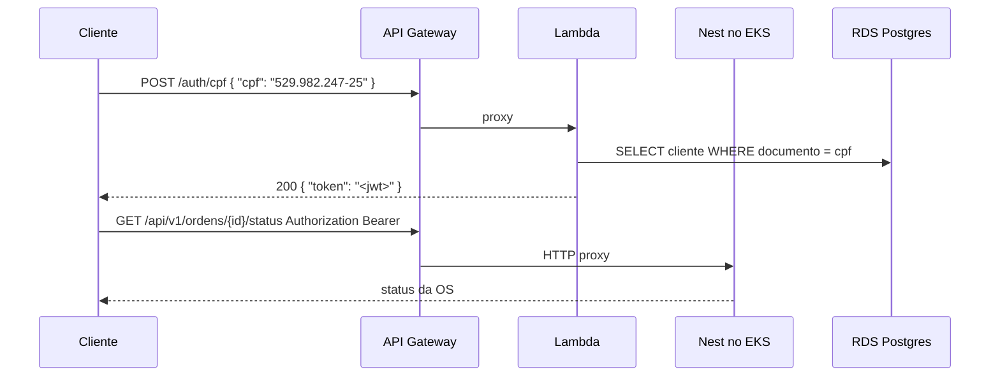

# Autenticação do cliente via CPF (Lambda + API Gateway)

Function serverless da Fase 3: valida CPF, consulta o cliente no Postgres e devolve um JWT. **Login de admin (e-mail/senha) continua na API Nest.**

API Nest (roles, rotas, JWT): [oficina-mecanica-api](https://github.com/32SOAT/oficina-mecanica-api) — em especial [docs/architecture/auth.md](https://github.com/32SOAT/oficina-mecanica-api/blob/main/docs/architecture/auth.md).

O mesmo API Gateway também faz **proxy HTTP** das rotas `/api/...` para o Nest (NLB do EKS), quando `nest_api_url` está preenchido.

## Tecnologias

Node 22 · TypeScript · `jsonwebtoken` · `pg` · API Gateway HTTP API · Terraform · GitHub Actions

## Fluxo



JWT (`role: cliente`):

```json
{ "sub": "<id-do-cliente>", "cpf": "52998224725", "role": "cliente" }
```

Use o **mesmo `JWT_SECRET`** da API. Status do cliente = `deleted_at IS NULL` (ativo). O Nest recusa JWT de cliente nas rotas de oficina (`RolesGuard`; default = admin) e aceita nas de status/aprovar/reprovar.

| Rota no Gateway | Destino |
| --- | --- |
| `POST /auth/cpf` | Lambda |
| `ANY /{proxy+}` (ex.: `/api/v1/...`, `/api`) | Nest, se `nest_api_url` estiver setado |
| `POST /api/v1/auth/login` | Nest (admin) |

## Contrato HTTP

`POST /auth/cpf`

```json
{ "cpf": "529.982.247-25" }
```

- `200` `{ "token": "..." }`
- `400` CPF ausente ou inválido
- `401` cliente não encontrado ou inativo
- `503` falha de infraestrutura (Postgres indisponível, erro ao emitir JWT)

## Como rodar localmente

### Opção 1 — Docker (Postgres + servidor HTTP)

Sobe Postgres com um cliente de teste e expõe `POST /auth/cpf` na porta 3000:

```bash
npm run docker:up
```

**Linux/macOS (curl):**

```bash
curl -s -X POST http://localhost:3000/auth/cpf \
  -H "content-type: application/json" \
  -d '{"cpf":"529.982.247-25"}'
```

**Windows (PowerShell):**

```powershell
Invoke-RestMethod -Method POST -Uri http://localhost:3000/auth/cpf `
  -ContentType "application/json" `
  -Body '{"cpf":"529.982.247-25"}'
```

Para parar e remover volumes:

```bash
npm run docker:down
```

Logs do serviço de auth: `npm run docker:logs`

### Opção 2 — Node no host (Postgres via Docker)

1. Suba só o banco: `docker compose up -d postgres` (Postgres na porta **5433** do host)
2. Copie `.env.example` para `.env`
3. Inicie o servidor local: `npm run dev:local`
4. Teste com um dos comandos da Opção 1 em `http://localhost:3000/auth/cpf`

O cliente seed usa CPF `529.982.247-25` (`52998224725` no banco).

## Como rodar os testes

**Unitários** (sem Postgres):

```bash
npm ci
npm test
npm run build
```

**Integração** (Postgres necessário — ex.: `docker compose up -d postgres`):

```bash
npm run test:integration
```

O bundle fica em `dist/handler.js` (handler `handler.handler`).

## Deploy (Terraform)

Ordem no Academy: **EKS + RDS + Nest no ar primeiro**, depois esta Lambda. Sem o hostname do NLB o Gateway só autentica CPF. Passo a passo do lab: [academy-passo-a-passo.md](https://github.com/32SOAT/oficina-mecanica-api/blob/main/docs/deployment/academy-passo-a-passo.md) (seção 6).

1. `npm run build`
2. `cd infra && cp terraform.tfvars.example terraform.tfvars`
3. Preencha host do RDS, senha, `jwt_secret` (**igual** ao da API).
4. **AWS Academy:** `lambda_role_arn` = ARN do `LabRole`. Sem isso o `CreateRole` falha.
5. Para a Lambda alcançar o RDS, informe `subnet_ids` (privadas) e `security_group_ids`.
6. Com o Nest no ar:

```powershell
kubectl -n oficina-mecanica get svc
```

Cole o hostname do NLB em `nest_api_url` (HTTP, **sem** barra no final):

```hcl
nest_api_url = "http://xxxx.elb.us-east-1.amazonaws.com"
```

7. `terraform init && terraform apply`

> O arquivo `infra/.terraform.lock.hcl` fica versionado no Git para garantir as mesmas versões dos providers em todo ambiente (local e CI).

A URL sai em `terraform output api_endpoint`. `nest_proxy_enabled` deve ser `true`.

Teste:

**Linux/macOS:**

```bash
# CPF
curl -s -X POST "$ENDPOINT/auth/cpf" \
  -H "content-type: application/json" \
  -d '{"cpf":"529.982.247-25"}'

# Health via proxy
curl -s "$ENDPOINT/api/v1/health"

# Status da OS (cole o token do passo 1)
curl -s "$ENDPOINT/api/v1/ordens/UUID-DA-OS/status" \
  -H "Authorization: Bearer COLE_O_TOKEN"
```

**Windows (PowerShell):**

```powershell
$ENDPOINT = "https://xxxx.execute-api.us-east-1.amazonaws.com"

# CPF
Invoke-RestMethod -Method POST -Uri "$ENDPOINT/auth/cpf" `
  -ContentType "application/json" `
  -Body '{"cpf":"529.982.247-25"}'

# Health via proxy
Invoke-RestMethod -Uri "$ENDPOINT/api/v1/health"

# Status da OS (cole o token do passo 1)
Invoke-RestMethod -Uri "$ENDPOINT/api/v1/ordens/UUID-DA-OS/status" `
  -Headers @{ Authorization = "Bearer COLE_O_TOKEN" }
```

Se o health do Nest funciona no NLB direto mas **timeout** no Gateway, o NLB provavelmente está restrito por CIDR. Em `infra/.env` da API, `TF_VAR_api_allowed_cidr_blocks` precisa permitir `0.0.0.0/0` para o Gateway alcançar.

Antes de `terraform destroy` da API (EKS/RDS), destrua **este** Terraform (Gateway + Lambda).
